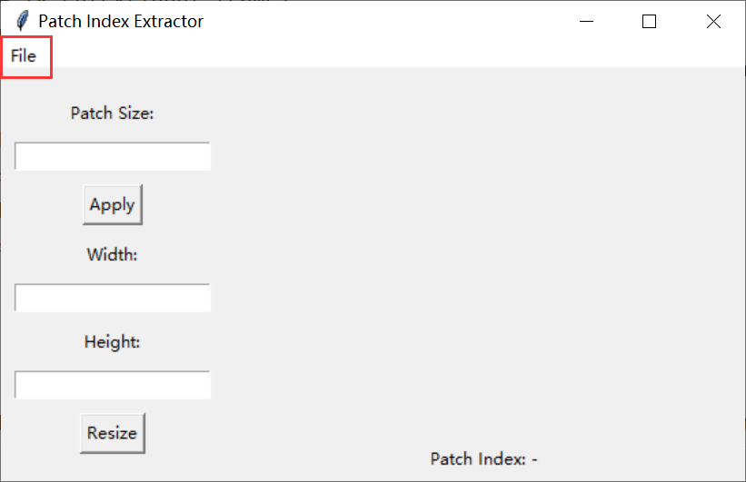
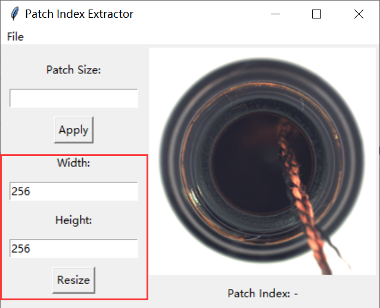
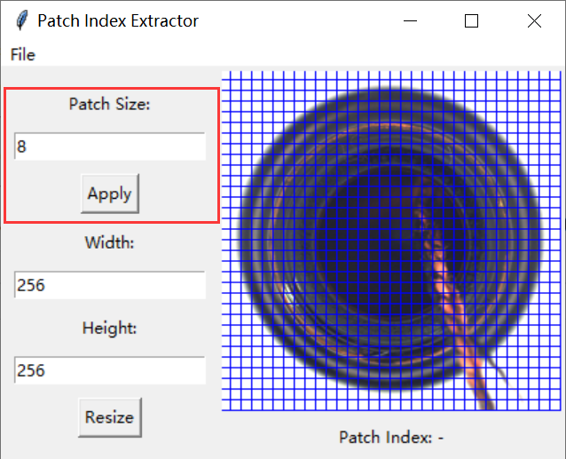
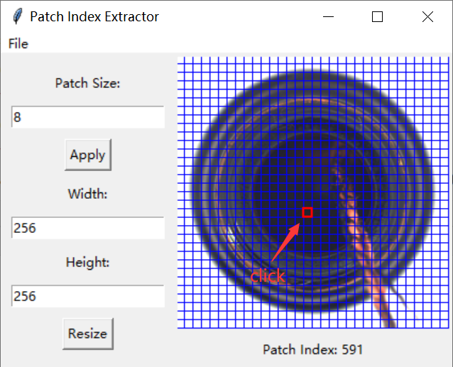

# Patch Index Extractor

## Introduction
众所周知，vision transformer会将一张图像划分为许多patch，然后提取每个patch的特征，但是在研究各个patch间的关系时，将图像中的一个区域与patch对应是一个比较麻烦的事，比如下图，我想知道左边的狮子头部与右边狮子的头部处的特征是否相同，但是我不能直观地获取两个狮子头对应的patch，于是乎，这个demo出现了，仅需点一点即可获取想要区域的patch索引。

As we all know, vision transformer can divide an image into many patches and then extract the features of each patch. However, when studying the relationship between different patches, it is troublesome to map an intuitive area in the image to patch. As shown in the following figure, I want to know whether the features of the head of the lion on the left are the same as those of the head of the right lion, but I cannot intuitively know which patches correspond to the two lion heads. Therefore, this demo appears, and the patch index of the desired area can be obtained by just clicking.


## Usage
Running ``` main.py```  directly is recommended because ``` main.exe```  is slow.

### step1:

Click ***File*** in the menu to load the image.



### step2:

Set the width and height of the image, change the image resolution, default to the original image size.



### step3:

Set the patch size to divide the resized image into many patches.



### step4:

Click on any patch to display the index of that patch below the image.




